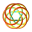

# ⚙️ Swirl_String_core: Hybrid Benchmark Engine for the Swirl-String Theory

Welcome to **Swirl_String_core**, the computational backbone for the Swirl-String Theory (SST).  
This hybrid C++/Python engine is designed to benchmark field-based gravity, time dilation, and EM swirl-field dynamics using modern numerical methods and a large helping of theoretical audacity. This repository contains the core engine, simulation scripts, and visualizations to explore the swirling depths of æther dynamics.
We build the C++ SST-Bindings first, and then we can import it into benchmark Python code. When using the C++  SST-bindings to do hard calculations we can run / render Python simulations 10-100x faster.

---

## 💾 Features

- 🚀 **High-Performance Core (C++)**  
  Handles numerically stiff vortex dynamics, EM field evolution, and topological energy exchanges.

- 🐍 **Python Frontend**  
  For visualization, parameter sweeps, and interactive experiments using `matplotlib`, `numpy`, and `PyBind11` integration.

- 🧲 **EM Field Simulations**  
  Supports generation and animation of **rotating 3-phase bivort** electric and magnetic field structures.

- ⌛ **Time Dilation & Gravity Models**  
  Fast comparison of GR vs SST predictions in strong field limits.

---

## 🧪 Sample Outputs

| Simulation | Output |
|-----------|--------|
| Time Dilation Field |  |
| Æther Inflow Velocity |  |
| Rotating EM Vortex |  |

---

### SSTCORE Installation Guide (Windows)

This precompiled `sstbindings.cp311-win_amd64.pyd`  file is a pybind11 module
compiled for Python 3.11 on 64-bit Windows.

## ✅ Installation Steps

1. Determine your Python version:
   ```bash
   python --version
   ```

2. Copy the matching `.pyd` file into your Python project directory.
   Example:
   ```
   your_project/
   ├── sstbindings.cp311-win_amd64.pyd
   └── your_script.py
   ```

3. In your script:
   ```python
   import sstbindings
   ```

4. Use the exposed functions/classes such as:
   ```python
   vortex = sstbindings.VortexKnotSystem()
   vortex.initialize_trefoil_knot()
   ```

If you encounter an ImportError:
- Make sure the `.pyd` file matches your Python version and architecture (64-bit)
- Recompile using CMake and pybind11 if necessary for other OS


## 📦 Build & Run
I advise to make use of IDE like CLion, PyCharm or Visual Studio for building and running the project. When using CLion, you can follow these steps:
You must install Visual Studio 2022 with C++ support, and then you can use CLion to build the project.

### ⚙️ Repair MSVC with the Visual Studio Installer
Open the Visual Studio Installer and do the following:
- Find Visual Studio 2022 Community
- Click Modify

### Make sure the following are selected:
✔ Individual components:
✅ MSVC v14.3x - x64/x86 build tools
✅ Windows 10 SDK (or 11)
✅ C++ CMake tools for Windows
✅ C++ ATL/MFC support (optional)
✅ C++ Standard Library (STL)
After this, reboot CLion and retry the build.

### 🔧 Use Clang Toolchain (if MSVC is broken)
You can switch CLion to use Clang (LLVM):
Install LLVM from: https://github.com/llvm/llvm-project/releases
Point CLion to `clang++.exe` in your toolchain settings
You can still use `pybind11` + `C++23` this way and avoid MSVC issues altogether.

### 🐍 Install Python Dependencies
Make sure you have Python 3.11+ installed, then create a virtual environment and install the required packages.
This might be the time to take a look at Conda, which is a package manager that can help you manage Python environments and dependencies more easily.
```bash
conda create -n  SSTcore12    python=3.12
conda activate  SSTcore12 
```

We now have to at least `pip install pybind11` and  `pip install numpy` to run the Python bindings.
I recommend to use a `requirements.txt` file to manage the dependencies of the project, it will reflect my environment.
```bash
pip install -r requirements.txt
```
To keep file up to date: `pip freeze > requirements.txt`

### 🛠️ Get pyBind11 inside the project
```bash
mkdir extern
mkdir extern/pybind11
git clone https://github.com/pybind/pybind11.git extern/pybind11
````


### 🔨 Build C++ Core
Before building, ensure you have CMake installed and your environment is set up correctly.
Download and install CMake https://cmake.org/download/

First initialize the CMake project, this results in a new directory `cmake-build-debug-mingw` or  similar in the project.
You can now use the following commands (from project root) to build the C++ core and generate the Python bindings: 
```bash
mkdir build
cd build
cmake ..
cmake --build . --config Debug  # or Release

```
This command compiles the C++ core and generates the Python bindings using `pybind11`.

### 📦 Test if python receives SST Bindings `
```bash
python -c "import sstbindings; print(sstcore)"
````
This should return `<module 'sstcore' from 'C:\\workspace\\projects\\sstcore\\build\\Debug\\sstbindings.cp312-win_amd64.pyd'>`
This indicates that the Python bindings for SSTcore have been successfully built and installed.
If this command fails, ensure that `sstbindings.cp311-win_amd64.pyd` is found in the same directory where you run python.
When it does not work, you can delete the `cmake-build` and `build` folder and try to recompile the C++ bindings from within `./build/` with `cmake ..` followed by  `cmake --build . --config Debug` again.

### 🐍 Import the SST Bindings in Python
```
from sstbindings import VortexKnotSystem, biot_savart_velocity, compute_kinetic_energy
```


### 🔨 Load the C++ module dynamically from the compiled path, because the SST Bindings are not installed in the Python site-packages.
```python
import os
module_path = os.path.abspath("C:\\workspace\\projects\\sstcore\\build\\Debug\\sstbindings.cp312-win_amd64.pyd")
module_name = "sstcore"
```

### 📊 Run Benchmarks
```bash
python tests/test_potential_timefield.py
```
---

### 📂 Project Structure
```bash
project-root/
├── build/
│   └── ...
├── examples/
│   ├── example_fluid_rotation.py
│   ├── example_potential_flow.py
│   ├── example_vortex_ring.py
│   └── ...
├── src/
│   ├── fluid_dynamics.cpp
│   ├── thermo_dynamics.cpp
│   ├── vorticity_dynamics.cpp
│   └── ...
├── src_bindings/
│   ├── module_sst.cpp
│   ├── py_fluid_dynamics.cpp
│   ├── py_thermo_dynamics.cpp
│   ├── py_vorticity_dynamics.cpp
│   └── ...
├── extern/pybind11/         # <-- Git submodule or manually cloned -- git clone https://github.com/pybind/pybind11.git extern/pybind11
├── CMakeLists.txt
```


## 🧠 Author   

**ORCID**: [0009-0006-1686-3961](https://orcid.org/0009-0006-1686-3961)  
Conceived, written, and fearlessly pushed into the void by a person undeterred by the collapse of academic consensus.

---

## 📖 Documentation
- Theory Overview
- Swirl Core Model
- Benchmarked Results

---

## 🧃 Warning
This software may cause:
- Vortex-based worldview shifts
- Sudden rejection of spacetime curvature
- Hallucinations of swirling field lines in your breakfast cereal
---

## 💬 Contact
Open an issue or whisper into the æther.
This code is listening. Always.
---

This document provides a summary of implemented functions in the SST C++/Python library along with their corresponding physical and mathematical formulas.

```bash
conda create -n SSTcore intelpython3_full python=3.11 -c https://software.repos.intel.com/python/conda -c conda-forge --override-channels
conda activate SSTcore

conda install conda -c https://software.repos.intel.com/python/conda/
conda install conda -c conda-forge
conda install conda -c main
conda config --add channels conda-forge
conda config --set channel_priority flexible

conda install scikit-learn -c https://software.repos.intel.com/python/conda/
conda install scikit-learn-intelex -c https://software.repos.intel.com/python/conda/
conda install xgboost -c https://software.repos.intel.com/python/conda/
conda install numpy -c https://software.repos.intel.com/python/conda/ -c conda-forge
conda install scipy -c https://software.repos.intel.com/python/conda/ -c conda-forge
conda install numexpr -c https://software.repos.intel.com/python/conda/ -c conda-forge
```
# Swirl String Theory (SST) Core Library Reference
**Version:** 2.1.0 (Parser Upgrade) | **Generated:** 2025-11-21

This document is **automatically compiled** from the C++ Source Code (`src_bindings/`).
It supports both `R"pbdoc` and Standard String documentation.

---

## 1. SST Gravity & Metric Engineering

### `biot_savart_vector_potential_grid`
🛠️ *[Auto-Extracted from py_field_kernels.cpp]*

**Description:** Computes Magnetic Vector Potential A on a grid.

**Equation:**
$$
Computes Magnetic Vector Potential A on a grid.
$$

---
### `compute_beltrami_shear`
✅ **[SST Canon]**

**Description:** Calculates the Beltrami Shear Stress (Vacuum Tearing). Measures deviation from Force-Free state.

**Equation:**
$$
S = \left\| \vec{B} \times (\nabla \times \vec{B}) \right\|
$$

---
### `compute_gravitational_potential`
✅ **[SST Canon]**

**Description:** Computes the effective gravitational potential derived from the vorticity distribution.

**Equation:**
$$
\Phi_G(\vec{r}) = -G \int \frac{|\vec{\omega}(\vec{r}')|^2}{|\vec{r} - \vec{r}'|} d^3r'
$$

---
### `compute_gravity_dilation`
✅ **[SST Canon]**

**Description:** Computes the scalar Gravity Dilation Map (G_local). Limits to 0 as induced velocity approaches swirl velocity.

**Equation:**
$$
G_{local} = G_0 \left[ 1 - \left( \frac{|\vec{B}| \cdot \log_{10}(\omega)}{\rho_{vac} \cdot v_{swirl}} \right)^2 \right]
$$

---
### `compute_time_dilation_map`
✅ **[SST Canon]**

**Description:** Computes local time dilation based on the transverse velocity of the vortex filaments.

**Equation:**
$$
\Delta t' = \Delta t \sqrt{1 - \frac{v_t^2}{c_{eth}^2}}
$$

---
### `potential_temperature`
✅ **[SST Canon]**

**Description:** Temperature a fluid parcel would attain if brought adiabatically to standard pressure.

**Equation:**
$$
\theta = T \left( \frac{P_0}{P} \right)^{R/c_p}
$$

---
### `potential_vorticity`
✅ **[SST Canon]**

**Description:** Computes Ertel Potential Vorticity, conserved in adiabatic flow.

**Equation:**
$$
PV = \frac{\vec{\omega} \cdot \nabla \theta}{\rho}
$$

---
## 2. Fluid Dynamics & Vortex Solvers

### `bernoulli_pressure`
🛠️ *[Auto-Extracted from py_potential_flow.cpp]*

**Description:** See Description

**Equation:**
$$
See Description
$$

---
### `biot_savart_vector_potential_grid`
🛠️ *[Auto-Extracted from py_field_kernels.cpp]*

**Description:** Computes Magnetic Vector Potential A on a grid.

**Equation:**
$$
Computes Magnetic Vector Potential A on a grid.
$$

---
### `biot_savart_velocity`
✅ **[SST Canon]**

**Description:** Computes the induced velocity (B-field) via Biot-Savart Law.

**Equation:**
$$
\vec{v}(\vec{r}) = \frac{\Gamma}{4\pi} \oint_C \frac{d\vec{l} \times (\vec{r} - \vec{r}')}{|\vec{r} - \vec{r}'|^3}
$$

---
### `biot_savart_velocity_grid`
✅ **[SST Canon]**

**Description:** Vectorized Biot-Savart solver for arbitrary 3D grids.

**Equation:**
$$
\vec{v}_{ij k} = \sum_{seg} \text{BiotSavart}(\vec{r}_{ijk}, \vec{l}_{seg})
$$

---
### `biot_savart_wire_grid`
✅ **[SST Canon]**

**Description:** Optimized kernel for polyline-to-grid field induction.

**Equation:**
$$
\vec{B}(\vec{x}) = \frac{\mu_0 I}{4\pi} \sum \frac{d\vec{l} \times \hat{r}}{r^2}
$$

---
### `compute_bernoulli_pressure`
✅ **[SST Canon]**

**Description:** Alias for pressure field computation.

**Equation:**
$$
P + \frac{1}{2}\rho v^2 = \text{const}
$$

---
### `compute_pressure_field`
✅ **[SST Canon]**

**Description:** Computes the macroscopic pressure field using the Bernoulli principle for incompressible flow.

**Equation:**
$$
P = P_{\infty} - \frac{1}{2} \rho_{ae} |\vec{v}|^2
$$

---
### `compute_swirl_field`
🛠️ *[Auto-Extracted from py_swirl_field.cpp]*

**Description:** Compute 2D swirl force field at a given resolution and time.

**Equation:**
$$
Compute 2D swirl force field at a given resolution and time.
$$

---
### `compute_velocity_magnitude`
🛠️ *[Auto-Extracted from py_fluid_dynamics.cpp]*

**Description:** Compute magnitude |v| from vector velocity field.

**Equation:**
$$
Compute magnitude |\vec{v}| from vector velocity field.
$$

---
### `compute_vorticity`
🛠️ *[Auto-Extracted from py_vorticity_dynamics.cpp]*

**Description:** See Description (Arg Name Detected)

**Equation:**
$$
See Description (Arg Name Detected)
$$

---
### `compute_vorticity_rhs`
🛠️ *[Auto-Extracted from py_vorticity_transport.cpp]*

**Description:** Vorticity transport RHS

**Equation:**
$$
Vorticity transport RHS
$$

---
### `couette_vorticity`
🛠️ *[Auto-Extracted from py_vorticity_dynamics.cpp]*

**Description:** See Description (Arg Name Detected)

**Equation:**
$$
See Description (Arg Name Detected)
$$

---
### `hill_velocity`
🛠️ *[Auto-Extracted from py_vortex_ring.cpp]*

**Description:** See Description

**Equation:**
$$
See Description
$$

---
### `hill_vorticity`
🛠️ *[Auto-Extracted from py_vortex_ring.cpp]*

**Description:** See Description

**Equation:**
$$
See Description
$$

---
### `lamb_oseen_velocity`
🛠️ *[Auto-Extracted from py_vortex_ring.cpp]*

**Description:** See Description

**Equation:**
$$
See Description
$$

---
### `lamb_oseen_vorticity`
🛠️ *[Auto-Extracted from py_vortex_ring.cpp]*

**Description:** See Description

**Equation:**
$$
See Description
$$

---
### `potential_vorticity`
✅ **[SST Canon]**

**Description:** Computes Ertel Potential Vorticity, conserved in adiabatic flow.

**Equation:**
$$
PV = \frac{\vec{\omega} \cdot \nabla \theta}{\rho}
$$

---
### `pressure_gradient`
🛠️ *[Auto-Extracted from py_pressure_field.cpp]*

**Description:** Compute spatial pressure gradient vector field.

**Equation:**
$$
Compute spatial pressure gradient vector field.
$$

---
### `solid_body_rotation_vorticity`
🛠️ *[Auto-Extracted from py_vorticity_dynamics.cpp]*

**Description:** See Description (Arg Name Detected)

**Equation:**
$$
See Description (Arg Name Detected)
$$

---
### `swirl_clock_rate`
✅ **[SST Canon]**

**Description:** The local tick-rate of the fluid element, derived from the 2D curl component.

**Equation:**
$$
\Omega_z = \frac{1}{2} \left( \frac{\partial v}{\partial x} - \frac{\partial u}{\partial y} \right)
$$

---
### `swirl_energy`
✅ **[SST Canon]**

**Description:** Rotational kinetic energy density of the vortex system.

**Equation:**
$$
E_k = \frac{1}{2} \rho \int_V |\vec{\omega}|^2 \, dV
$$

---
### `vortex_pressure_drop`
🛠️ *[Auto-Extracted from py_fluid_dynamics.cpp]*

**Description:** Pressure drop 0.5 * ρ * c^2 in a vortex core.

**Equation:**
$$
Pressure drop \frac{1}{2} ρ c^2 in a vortex core.
$$

---
### `vortex_transverse_pressure_diff`
🛠️ *[Auto-Extracted from py_fluid_dynamics.cpp]*

**Description:** Transverse pressure difference 0.25 * ρ * c^2.

**Equation:**
$$
Transverse pressure difference \frac{1}{4} ρ c^2.
$$

---
### `vorticity_from_curvature`
✅ **[SST Canon]**

**Description:** Approximates vorticity for curved laminar flow based on path radius.

**Equation:**
$$
|\vec{\omega}| \approx \frac{v}{R_{curve}}
$$

---
### `vorticity_z_2D`
🛠️ *[Auto-Extracted from py_vorticity_dynamics.cpp]*

**Description:** Compute 2D vorticity

**Equation:**
$$
\frac{\partial v}{\partial x} - \frac{\partial u}{\partial y}
$$

---
## 3. Topological Metrics

### `compute_centerline_helicity`
✅ **[SST Canon]**

**Description:** Total helicity decomposed into Writhe and Twist.

**Equation:**
$$
H = Wr + Tw
$$



---
### `compute_helicity`
✅ **[SST Canon]**

**Description:** Computes Hydrodynamic Helicity (Knottedness).

**Equation:**
$$
\mathcal{H} = \int_V \vec{v} \cdot \vec{\omega} \, dV
$$


---
### `compute_linking_number`
✅ **[SST Canon]**

**Description:** Gauss Linking Number between two closed loops.

**Equation:**
$$
Lk = \frac{1}{4\pi} \oint_{\gamma_1} \oint_{\gamma_2} \frac{\vec{r}_{12} \cdot (d\vec{r}_1 \times d\vec{r}_2)}{r_{12}^3}
$$

---
### `compute_writhe`
✅ **[SST Canon]**

**Description:** The Writhe number (Gauss integral), measuring global coiling.

**Equation:**
$$
Wr = \frac{1}{4\pi} \iint \frac{(\vec{r}_1-\vec{r}_2) \cdot (d\vec{r}_1 \times d\vec{r}_2)}{|\vec{r}_1-\vec{r}_2|^3}
$$


---
### `evaluate_fourier_block`
🛠️ *[Auto-Extracted from py_fourier_knot.cpp]*

**Description:** Evaluate r(s) for the given Fourier block.

**Equation:**
$$
Evaluate r(s) for the given Fourier block.
$$

---
### `evaluate_fourier_series`
✅ **[SST Canon]**

**Description:** Reconstructs knot geometry from Fourier coefficients.

**Equation:**
$$
\vec{r}(t) = \sum [ \vec{a}_n \cos(nt) + \vec{b}_n \sin(nt) ]
$$

---
### `evolve_vortex_knot`
🛠️ *[Auto-Extracted from py_frenet_helicity.cpp]*

**Description:** Evolve vortex knot filaments using Biot–Savart dynamics.

**Equation:**
$$
Evolve vortex knot filaments using Biot–Savart dynamics.
$$


---
### `fourier_knot_eval`
🛠️ *[Auto-Extracted from py_fourier_knot.cpp]*

**Description:** NumPy-friendly Fourier evaluation returning (x,y,z)

**Equation:**
$$
NumPy-friendly Fourier evaluation returning (x,y,z)
$$


---
### `writhe_gauss_curve`
🛠️ *[Auto-Extracted from py_heavy_knot.cpp]*

**Description:** Compute writhe via Gauss integral

**Equation:**
$$
Compute writhe via Gauss integral
$$


---

---

## 🌀 Helicity

**Function**: `compute_helicity(velocity, vorticity)`

**Formula**:
$${H} = \int_{\mathbb{R}^3} \mathbf{v} \cdot \omega \, d^3\mathbf{r}$$

---

## ⚡ Kinetic Energy

**Function**: `compute_kinetic_energy(velocity, rho_ae)`

**Formula**:
$$E = \frac{1}{2} \rho_æ \int |\mathbf{v}|^2 \, d^3\mathbf{r}$$

---

## 🧩 Curvature

**Function**: `compute_curvature_torsion(positions)`

**Formula**:
$$\kappa(s) = \left\| \frac{d^2 \mathbf{X}}{ds^2} \right\|$$

---

## 🔁 Torsion

**Function**: `compute_curvature_torsion(positions)`

**Formula**:
$$\tau(s) = \frac{ \left( \frac{d \mathbf{X}}{ds} \times \frac{d^2 \mathbf{X}}{ds^2} \right) \cdot \frac{d^3 \mathbf{X}}{ds^3} }{ \left\| \frac{d \mathbf{X}}{ds} \times \frac{d^2 \mathbf{X}}{ds^2} \right\|^2 }$$

---

## 🌌 Gravitational Acceleration (Bernoulli Gradient)

**Function**: `pressure_gradient` and `compute_bernoulli_pressure`

**Formula**:
$$\mathbf{g}(\mathbf{r}) = -\frac{1}{\rho_æ} \nabla P(\mathbf{r}) = \nabla \left( \frac{1}{2} |\mathbf{v}|^2 \right)$$

---

## ⏳ Time Dilation from Tangential Velocity

**Function**: `compute_time_dilation_map(tangential_velocities, ce)`

**Formula**:
$$\text{Time Dilation} = 1 - \frac{v^2}{C_e^2}$$

---

## 🌀 Gravitational Potential from Vorticity

**Function**: `compute_gravitational_potential(positions, vorticity, aether_density)`

**Formula**:
$$\Phi(\mathbf{r}) = \text{scalar potential derived from vorticity field}$$

---

Generated by SST Core — Swirl-String Theory Simulation Toolkit